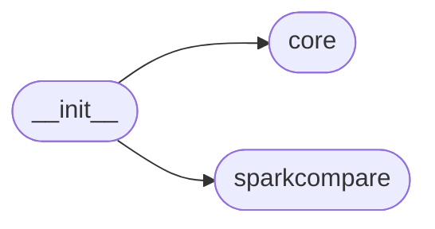

# Code Overview

[_Documentation generated by Documatic_](https://www.documatic.com)

<!---Documatic-section-Codebase Structure Python-start--->
## Codebase Structure Python

The codebase has a flat structure, with 3 code files.

<!---Documatic-block-system_architecture-start--->

<!---Documatic-block-system_architecture-end--->

# #
<!---Documatic-section-Codebase Structure Python-end--->

<!---Documatic-section-Key Objects-start--->
## Key Objects

There are exposed imports at level-0
from the source directory (datacompy)

<!---Documatic-block-datacompy-start--->

	
<code>datacompy</code> (Click to Expand!)

* `datacompy.core.Compare`
* `datacompy.core.LOG`
* `datacompy.core.calculate_max_diff`
* `datacompy.core.columns_equal`
* `datacompy.core.compare_string_and_date_columns`
* `datacompy.core.generate_id_within_group`
* `datacompy.core.get_merged_columns`
* `datacompy.core.render`
* `datacompy.core.temp_column_name`
* `datacompy.sparkcompare.NUMERIC_SPARK_TYPES`
* `datacompy.sparkcompare.SparkCompare`

<!---Documatic-block-datacompy-end--->

# #
<!---Documatic-section-Key Objects-end--->

<!---Documatic-section-Important Functions-start--->
## Important Functions

<!---Documatic-block-important_funcs-start--->
<!---Documatic-block-most_used_funcs-start--->
### Most Utilised Functions

* [datacompy.core.calculate_max_diff](4-datacompy_core.md#datacompy.core.calculate_max_diff) (1 times)
* [datacompy.core.columns_equal](4-datacompy_core.md#datacompy.core.columns_equal) (1 times)
* [datacompy.core.compare_string_and_date_columns](4-datacompy_core.md#datacompy.core.compare_string_and_date_columns) (1 times)
* [datacompy.core.generate_id_within_group](4-datacompy_core.md#datacompy.core.generate_id_within_group) (1 times)
* [datacompy.core.get_merged_columns](4-datacompy_core.md#datacompy.core.get_merged_columns) (1 times)
* [datacompy.core.render](4-datacompy_core.md#datacompy.core.render) (1 times)
* [datacompy.core.temp_column_name](4-datacompy_core.md#datacompy.core.temp_column_name) (1 times)
<!---Documatic-block-most_used_funcs-end--->

<!---Documatic-block-end_user_funcs-start--->
### End User Exposed Functions

* [datacompy.core.get_merged_columns](4-datacompy_core.md#datacompy.core.get_merged_columns)
* datacompy.sparkcompare.NUMERIC_SPARK_TYPES
* [datacompy.core.generate_id_within_group](4-datacompy_core.md#datacompy.core.generate_id_within_group)
* datacompy.core.Compare
* [datacompy.core.render](4-datacompy_core.md#datacompy.core.render)
* datacompy.sparkcompare.SparkCompare
* [datacompy.core.compare_string_and_date_columns](4-datacompy_core.md#datacompy.core.compare_string_and_date_columns)
* [datacompy.core.calculate_max_diff](4-datacompy_core.md#datacompy.core.calculate_max_diff)
* [datacompy.core.columns_equal](4-datacompy_core.md#datacompy.core.columns_equal)
* [datacompy.core.temp_column_name](4-datacompy_core.md#datacompy.core.temp_column_name)
* datacompy.core.LOG
<!---Documatic-block-end_user_funcs-end--->
<!---Documatic-block-important_funcs-end--->

# #
<!---Documatic-section-Important Functions-end--->

<!---Documatic-section-File IO-start--->
## File IO

<!---Documatic-block-file_io-start--->
The following files have file read operations

<!---Documatic-block-datacompy-start--->

	
<code>datacompy</code> (Click to Expand!)

* datacompy.core

<!---Documatic-block-datacompy-end--->

The following files have file write operations

<!---Documatic-block-datacompy-start--->

	
<code>datacompy</code> (Click to Expand!)

* datacompy.core

<!---Documatic-block-datacompy-end--->
<!---Documatic-block-file_io-end--->

# #
<!---Documatic-section-File IO-end--->

<!---Documatic-section-Class Hierarchy-start--->
## Class Hierarchy

<!---Documatic-block-Enum-start--->

	
<code>Enum</code> (Click to Expand!)

* datacompy.sparkcompare.MatchType

<!---Documatic-block-Enum-end--->

# #
<!---Documatic-section-Class Hierarchy-end--->

[_Documentation generated by Documatic_](https://www.documatic.com)